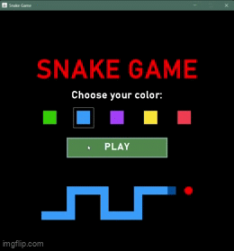
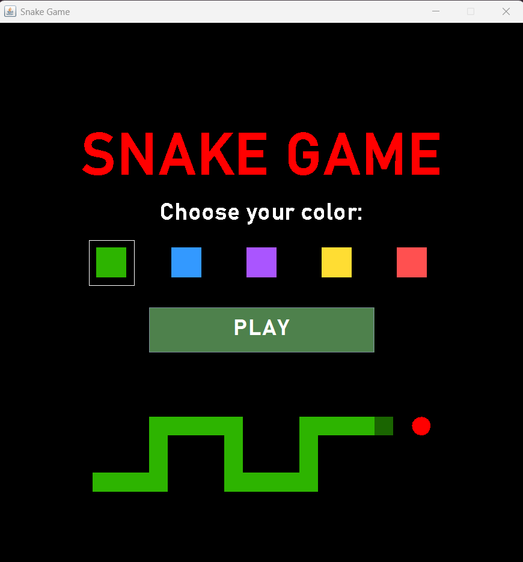
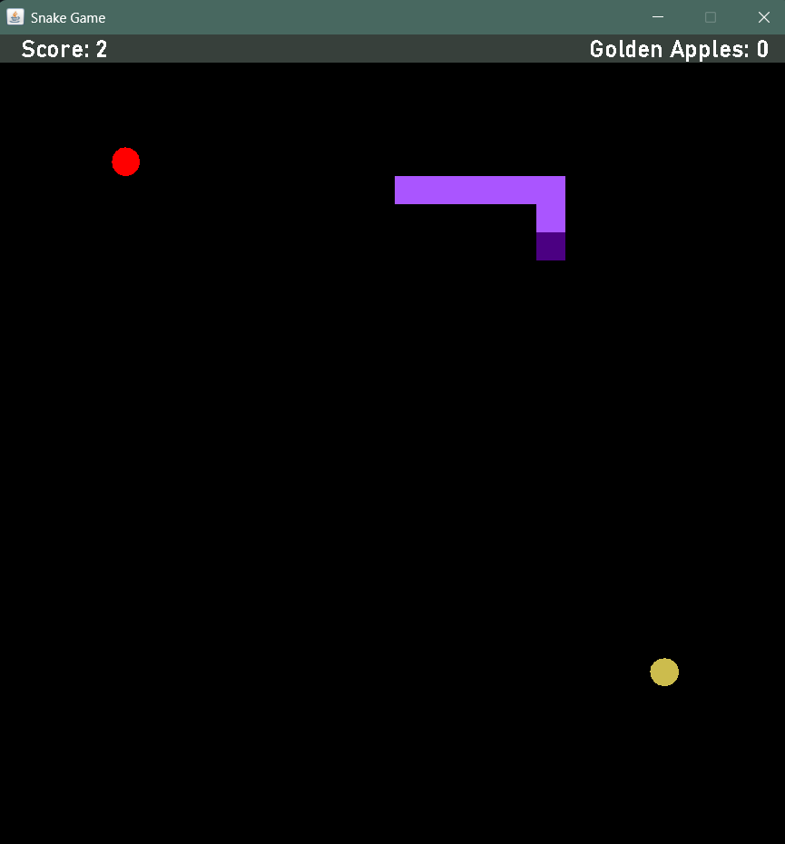
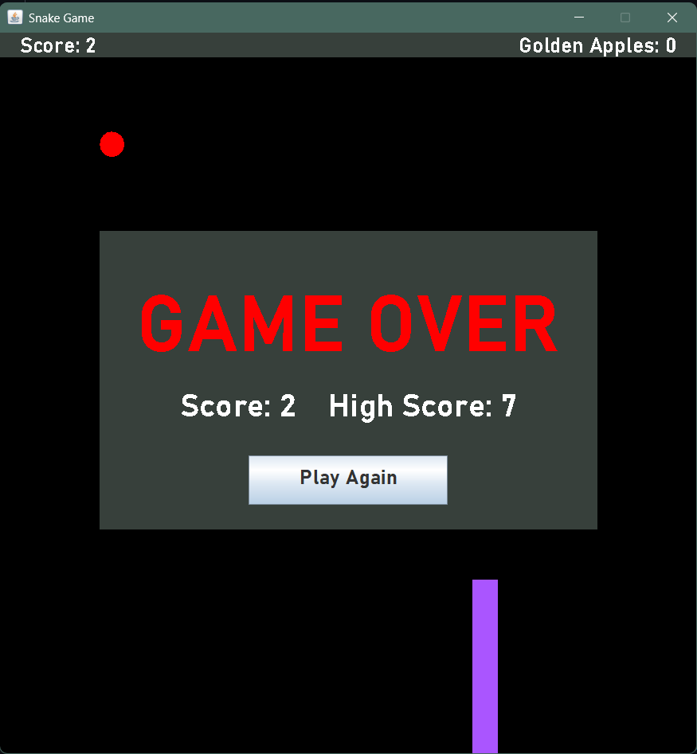

# Snake Game

A classic Snake game built in Java using Swing.



## Features

- Classic Snake gameplay
- Golden apples that grant bonus points and extra length
- Custom snake color selection
- High score tracking
- Play Again button
- Start screen

## Controls

- ↑ Move Up
- ↓ Move Down
- ← Move Left
- → Move Right

## Screenshots

### Start Screen


### Gameplay


### Game Over Screen


## Technologies Used

- Java
- Java Swing
- Java AWT

## How to Run

First, make sure you have Java installed.

1. Clone the repository:

```bash
git clone https://github.com/yourusername/snake-game-java.git
```

2. Open the project in your preferred Java IDE (such as IntelliJ IDEA, Eclipse, or VS Code), or compile it from the command line.

3. Run `StartGame.java`

Or download the `snake-game-1.0-SNAPSHOT.jar` file and open the file to run 
